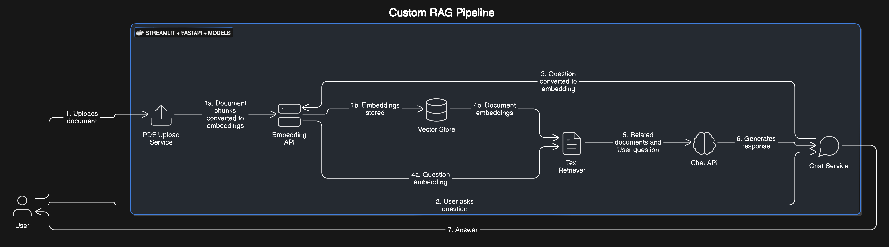

# Custom RAG Pipeline with Streamlit and FastAPI

This repository contains a custom Retrieval-Augmented Generation (RAG) pipeline implemented using Streamlit for the frontend and FastAPI for the backend. The application allows users to upload PDF documents, generate embeddings, and ask questions about the content, receiving contextually relevant responses.

## Features

- **PDF Upload and Processing**: Upload a PDF file and process it to extract text.
- **Embeddings Generation**: Generate embeddings for document chunks using a pre-trained transformer model.
- **Question Answering**: Ask questions about the document and get answers based on the document content.
- **Dockerized Application**: The entire application runs within a Docker container for easy deployment.

## Architecture

  <!-- Add the path to your architecture diagram here -->

1. **User**: Interacts with the Streamlit frontend.
2. **Streamlit App**: Provides UI for uploading PDFs and asking questions.
3. **FastAPI App**: Handles API requests for question answering.
4. **Embedder Model**: Generates embeddings for the documents, queries and does cosine similarity search.
5. **Generator Model**: Generates responses based on the context and user query.
6. **Docker Container**: Encapsulates the entire application environment.

## Setup

### Prerequisites

- Docker installed on your system.

### Pull Docker Image

You can pull the pre-built Docker image from GitHub Packages using the following command:

```bash
docker pull ghcr.io/viksam/customragpipeline:latest
